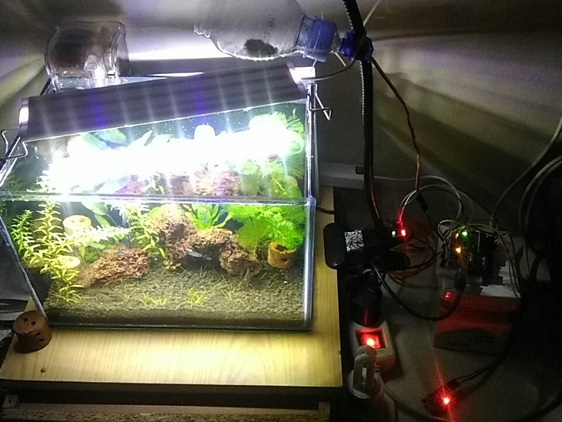

# Hi!
This is my mini project on aquarium monitoring. I want to make a system to control and monitor my aquarium that is a nano tank sized 30Cmx20Cmx30Cm. For now it only has autofeeder and lamp control. My next work will add a temperature control.
<h3>Tools i'm using:</h3>
<li>Arduino Uno</li>
<li>Servo Motor</li>
<li>5v Relay</li>
<li>Jumper cables</li>
<li>RTC(Real Time Clock) module</li>
<h3>Photo</h3>

